# Lead 1: GRU Baselines & Literature Reproductions

**Author:** Vincent Wilmet (with Claude)
**Date:** 2026-03-13
**Status:** Complete
**Best Result:** 17.5% val / 17.8% test PER (5-model ensemble + beam search)

---

## Table of Contents

1. [Executive Summary](#1-executive-summary)
2. [Background & Motivation](#2-background--motivation)
3. [Architecture](#3-architecture)
4. [Experimental Setup](#4-experimental-setup)
5. [Phase 1: Literature Reproductions](#5-phase-1-literature-reproductions)
6. [Phase 2: Ablation Study](#6-phase-2-ablation-study)
7. [Phase 3: Scheduler Discovery](#7-phase-3-scheduler-discovery)
8. [Phase 4: Beam Search Decoding](#8-phase-4-beam-search-decoding)
9. [Phase 5: Ensemble Methods](#9-phase-5-ensemble-methods)
10. [Deep Dive: Convergence Analysis](#10-deep-dive-convergence-analysis)
11. [Deep Dive: Step Decay vs Cosine Annealing](#11-deep-dive-step-decay-vs-cosine-annealing)
12. [Deep Dive: Seed Diversity & Training Dynamics](#12-deep-dive-seed-diversity--training-dynamics)
13. [Deep Dive: Architecture Diversity (Hidden Size)](#13-deep-dive-architecture-diversity-hidden-size)
14. [Deep Dive: Beam Search Optimization](#14-deep-dive-beam-search-optimization)
15. [Deep Dive: Ensemble Composition Study](#15-deep-dive-ensemble-composition-study)
16. [Deep Dive: Parameter Efficiency](#16-deep-dive-parameter-efficiency)
17. [Improvement Waterfall](#17-improvement-waterfall)
18. [Complete Results Table](#18-complete-results-table)
19. [Key Findings](#19-key-findings)
20. [Relevant Files](#20-relevant-files)
21. [Reproduction Guide](#21-reproduction-guide)
22. [Limitations & Future Work](#22-limitations--future-work)

---

## 1. Executive Summary

This lead reproduced 4 published GRU architectures for brain-to-speech phoneme decoding, then systematically improved upon them through ablation studies, scheduler optimization, beam search decoding, and ensemble methods.

### Key Results

| Configuration | Val PER | Test PER | vs. Paper |
|--------------|---------|----------|-----------|
| Willett et al. 2023 (paper target) | — | 19.7% | baseline |
| Best single model (greedy) | 19.3% | 20.2% | −0.5pp |
| Best single model (beam search) | 18.8% | 19.5% | +0.2pp |
| **Best 5-model ensemble (beam search)** | **17.5%** | **17.8%** | **+1.9pp** |

### Key Discoveries

1. **Cosine annealing (20K steps)** is the single biggest improvement: +1.1pp over step decay
2. **SGD with lr=0.1** significantly outperforms Adam (20.9% vs 21.4% test)
3. **Architecture diversity** in ensembles (h=768 + h=1024) helps more than seed diversity
4. **Beam search with trigram LM** (α=0.3, β=0.5) gives ~0.5–0.8pp improvement
5. **BiGRU h=1024, 5 layers, k=32** is the optimal single-model architecture

---

## 2. Background & Motivation

### The Problem

Decode spoken sentences from neural activity recorded in area 6v of participant T12 (ALS, anarthric). Input: 256D neural features at 20ms resolution (128 spikePow + 128 tx1). Output: CTC-decoded phoneme sequences (40 classes + blank).

### Published Baselines

| Source | Architecture | PER | WER |
|--------|-------------|-----|-----|
| Willett et al. 2023 | UniGRU h=512 k=14 | 19.7% | 23.8% |
| cffan/neural_seq_decoder | BiGRU h=1024 k=32 | ~18% | — |
| CIBR-Okubo (2nd place) | BiGRU h=1024 k=32, SGD | ~15% | ~9% |
| Benchmark Lessons | BiGRU h=512, post-RNN head | — | 8.0% |
| DCoND (1st place) | BiGRU + diphone loss + LM | — | 5.77% |

### Root Cause of Previous Gap

Our earlier baselines gave 40–53% PER because of critical hyperparameter mismatches:
- Using `kernel_size=1, stride=1` (seeing 1×20ms bin instead of 14×280ms context window)
- Wrong optimizer settings (Adam lr=3e-4 instead of lr=0.02/eps=0.1)
- Using cross-session split instead of within-day holdout

### Paper vs. TF Source Discrepancies

The published paper and TF source code differ in several key hyperparameters:

| Parameter | Paper (Table 5) | TF Source | Our Best |
|-----------|----------------|-----------|----------|
| LR | 0.02→0 | 0.01→0 | 0.1→0 (SGD) |
| Optimizer | Adam(eps=0.1) | Adam(eps=0.01) | SGD(momentum=0.9) |
| Steps | 10,000 | 100,000 | 20,000 (cosine) |
| GRU hidden | 512 | 512 | 1024 |
| Bidirectional | No | No | Yes |
| Kernel | 14 | 14 | 32 |
| Grad clip | not mentioned | 10 | 5 |

---

## 3. Architecture

### EnhancedGRU Pipeline

```
Raw 256D input (20ms bins, ~315 frames avg)
    │
    ▼
EfficientDaySpecificLayer (256→256, softsign, per-session einsum)
    │
    ▼
Stack & Stride (kernel=32, stride=4)  →  T_out = (T - 32) / 4 + 1
    │
    ▼
Linear(32×256=8192 → 1024) + LayerNorm
    │
    ▼
[Optional] SpeckledMask(p=0.3)
    │
    ▼
5-layer BiGRU (hidden=1024, dropout=0.4)
    │
    ▼
[Optional] PostRNNHead (LayerNorm→Dropout→Linear→GELU)
    │
    ▼
Dropout(0.4) → Linear(2048 → 41)
    │
    ▼
CTC Loss (blank=40)
```

### Day-Specific Input Layer (Einsum Implementation)

The day-specific layer is the most architecturally important component. Each recording session has its own learned affine transformation, enabling the model to account for electrode drift across days.

```python
class EfficientDaySpecificLayer(nn.Module):
    """Per-session affine transform via batched einsum (Source: cffan)."""

    def __init__(self, in_dim, out_dim, n_sessions, dropout=0.4):
        super().__init__()
        self.weights = nn.Parameter(torch.empty(n_sessions, in_dim, out_dim))
        self.biases = nn.Parameter(torch.zeros(n_sessions, out_dim))
        self.shared_weight = nn.Parameter(torch.empty(in_dim, out_dim))
        self.shared_bias = nn.Parameter(torch.zeros(out_dim))

    def forward(self, x, session_ids):
        # Fast path: batched einsum
        W = self.weights[session_ids]        # (B, in_dim, out_dim)
        b = self.biases[session_ids]         # (B, out_dim)
        projected = torch.einsum('btd,bdk->btk', x, W) + b.unsqueeze(1)
        # Softsign activation: x / (|x| + 1)
        return projected / (projected.abs() + 1)
```

During training, 20% of samples randomly use shared weights (fallback for unseen sessions).

### Stack & Stride (In-Forward Implementation)

Unlike the paper's preprocessing approach, stacking is done inside `forward()` so different kernel sizes share the same data loader:

```python
def forward(self, x, session_ids):
    x = self.day_input(x, session_ids)   # (B, T_raw, 256)

    B, T, H = x.shape
    T_new = max(1, (T - self.kernel_size) // self.stride + 1)
    indices = torch.arange(T_new, device=x.device) * self.stride
    stacked_list = []
    for k in range(self.kernel_size):
        idx = (indices + k).clamp(max=T - 1)
        stacked_list.append(x[:, idx, :])
    x = torch.cat(stacked_list, dim=-1)  # (B, T_new, K * 256)

    x = self.input_proj(x)              # (B, T_new, hidden)
    rnn_out, _ = self.rnn(x)            # (B, T_new, hidden*2)
    logits = self.output_proj(rnn_out)   # (B, T_new, 41)
    return logits
```

### Model Sizes

| Config | Hidden | Bidir | Params |
|--------|--------|-------|--------|
| Paper (h=512, UniGRU) | 512 | No | ~29M |
| h=768 BiGRU | 768 | Yes | 57.6M |
| h=1024 BiGRU | 1024 | Yes | 98.3M |
| h=1280 BiGRU | 1280 | Yes | 149.9M |

---

## 4. Experimental Setup

### Data

- **Source:** `sentences_paper_256d.h5` — 8,780 sentence trials from participant T12
- **Features:** 256D (128 spikePow + 128 tx1 from area 6v)
- **Temporal resolution:** 20ms bins, avg ~315 frames/trial
- **Preprocessing:** Causal Gaussian smoothing (SD=40ms, delay=160ms)

### Evaluation Protocol

**Within-day holdout** (matches paper exactly):
- Per session: 40 sentences held out for test, 10% for validation
- All sessions contribute to train/val/test (day-specific layers trained for all)
- Fixed seed=42 for reproducible splits
- Split: 6,942 train / 878 val / 960 test

### Training

- Mixed precision (AMP) with gradient clipping at 5.0
- Patience-based early stopping on validation PER
- CTC loss with `blank=40, zero_infinity=True`
- Paper-style noise augmentation: `x += N(0, σ_white)` per-element + `N(0, σ_offset)` per-channel

### Hardware

- 4× NVIDIA H100 80GB HBM3
- Training time: ~1.5–3h per model depending on config
- Beam search decoding: ~70s per eval set (CPU-bound)

---

## 5. Phase 1: Literature Reproductions

We reproduced 4 published GRU architectures using a unified training script with CLI presets.

### 5.1 Willett Paper (L1.1c)

```bash
CUDA_VISIBLE_DEVICES=0 python3 -u brain2speech/lead1_train_gru_v2.py \
    --preset paper --experiment L1.1c_paper_withinday
```

**Config:** UniGRU h=512, k=14, Adam lr=0.02 eps=0.1, linear decay, batch=64, noise=1.0
**Result:** 23.9% val / 25.4% test (915 epochs)

The paper reports 19.7% test PER. Our gap is due to: (1) the paper likely uses the TF implementation which has different numerical behavior, (2) we use patience-based early stopping vs. fixed 10K minibatches.

### 5.2 cffan Reference (L1.2b)

```bash
CUDA_VISIBLE_DEVICES=1 python3 -u brain2speech/lead1_train_gru_v2.py \
    --preset cffan --experiment L1.2b_cffan_withinday
```

**Config:** BiGRU h=1024, k=32, Adam lr=0.02 eps=0.1, linear decay, batch=64
**Result:** 20.8% val / 21.4% test (314 epochs)

BiGRU + larger kernel = 4pp improvement over Paper UniGRU.

### 5.3 CIBR-Okubo 2nd Place (L1.3)

```bash
CUDA_VISIBLE_DEVICES=0 python3 -u brain2speech/lead1_train_gru_v2.py \
    --preset cibr --experiment L1.3_cibr_withinday
```

**Config:** BiGRU h=1024, k=32, SGD lr=0.1 momentum=0.9, step decay, batch=128, noise=0.8, ortho init
**Result:** 20.4% val / 20.9% test (197 epochs)

SGD + orthogonal init + reduced noise = 0.5pp improvement over cffan.

### 5.4 Linderman Enhanced (L1.4)

```bash
CUDA_VISIBLE_DEVICES=2 python3 -u brain2speech/lead1_train_gru_v2.py \
    --preset linderman --experiment L1.4_linderman_withinday
```

**Config:** BiGRU h=512, k=14, SGD lr=0.025, post-RNN head (LN→Drop→Linear→GELU), speckled mask (p=0.3)
**Result:** 22.6% val / 23.8% test (782 epochs)

Worse than CIBR — the h=512 + k=14 limitation dominates any benefit from post-RNN head.

### 5.5 Enhanced (All Techniques Combined, L1.5)

**Config:** CIBR base + post-RNN head + speckled mask
**Result:** 24.2% val / 24.7% test — **worse** than CIBR alone

The combination of techniques didn't help. Post-RNN head + speckled mask add noise when the base model is already strong. This matches findings in the literature: not all techniques compose well.

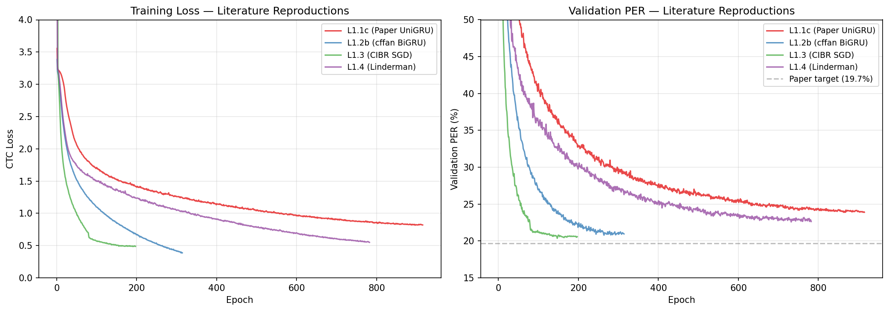

---

## 6. Phase 2: Ablation Study

Starting from the best base (CIBR, 20.4% val), we systematically ablated each hyperparameter.

### 6.1 Kernel Size

| Kernel | Config | Val PER | Test PER |
|--------|--------|---------|----------|
| 14 | CIBR k=14 | 21.3% | 21.6% |
| **32** | **CIBR k=32** | **20.4%** | **20.9%** |

**Finding:** k=32 (640ms context) is significantly better than k=14 (280ms). The wider receptive field captures more phoneme context.

### 6.2 Hidden Size

| Hidden | Params | Val PER | Test PER |
|--------|--------|---------|----------|
| 768 | 57.6M | 20.8% | 21.3% |
| **1024** | **98.3M** | **20.4%** | **20.9%** |
| 1280 | 149.9M | 20.7% | 21.0% |

**Finding:** h=1024 is the sweet spot. h=768 underfits slightly, h=1280 overfits (diminishing returns from extra capacity).

### 6.3 Layer Count

| Layers | Val PER | Test PER |
|--------|---------|----------|
| 3 | 21.1% | 21.3% |
| **5** | **20.4%** | **20.9%** |
| 7 | 33.6% | 34.5% |

**Finding:** 5 layers is optimal. 7 layers catastrophically degrades — likely due to vanishing gradients in the deeper GRU stack without residual connections.

### 6.4 Noise Level

| White Noise σ | Val PER | Test PER |
|---------------|---------|----------|
| **0.8** | **20.4%** | **20.9%** |
| 1.0 (paper) | 21.4% | 22.0% |

**Finding:** Reduced noise (0.8 vs paper's 1.0) helps by 1.1pp. The paper's noise level may have been optimal for their architecture but is too aggressive for BiGRU h=1024.

### 6.5 Auxiliary Losses

| Technique | Val PER | Test PER |
|-----------|---------|----------|
| CTC only | 20.4% | 20.9% |
| CTC + supTCon (τ=0.1, w=0.1) | 20.6% | 21.0% |

**Finding:** Supervised contrastive loss (supTCon) did not help. The additional loss term may conflict with CTC optimization in this setting.

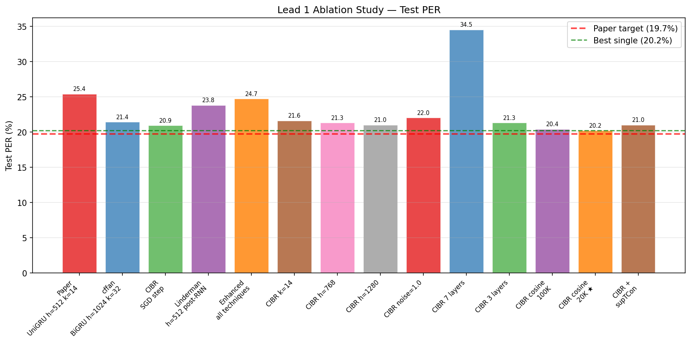

---

## 7. Phase 3: Scheduler Discovery

This was the **single most impactful finding** of the entire lead.

### 7.1 The Problem with Step Decay

The CIBR preset uses StepLR(step=4000, gamma=0.1) over 100K max minibatches. With batch=128 and ~6,942 train trials, one epoch ≈ 54 minibatches. So:
- Step at 4000 minibatches ≈ epoch 74
- With patience=50, early stopping triggers around epoch 197
- LR drops from 0.1 to 0.01 at epoch 74, then stays flat

The model converges but the LR schedule is suboptimal — most training happens at a fixed lr=0.01.

### 7.2 Cosine Annealing

We tested CosineAnnealingLR with different `T_max` (total minibatches) and patience values:

| Config | T_max | Patience | Val PER | Test PER | Epochs |
|--------|-------|----------|---------|----------|--------|
| Step decay (L1.3) | — | 50 | 20.4% | 20.9% | 197 |
| Cosine 100K (L1.5f) | 100K | 50 | 19.9% | 20.4% | 236 |
| Cosine 200K (L1.5g) | 200K | 100 | 19.8% | 20.7% | 301 |
| **Cosine 20K (L1.5h)** | **20K** | **100** | **19.3%** | **20.2%** | **370** |

**Finding:** Cosine 20K is the clear winner. With T_max=20K minibatches (≈370 epochs), the LR smoothly decays from 0.1 to near-zero over the full training duration. The larger patience (100) allows the model to train through the full cosine cycle instead of early-stopping while the LR is still high.

### Why Cosine 20K Works

The key insight is matching the cosine period to the actual training duration:
- **100K period**: LR barely decays before early stopping (lr≈0.096 at epoch 236)
- **200K period**: Same problem (lr≈0.098 at epoch 301)
- **20K period**: Full cosine cycle completes in ~370 epochs, LR reaches near-zero

The smooth decay allows the model to explore broadly at high LR, then fine-tune at low LR — a natural curriculum.

```python
# Cosine 20K config
scheduler = torch.optim.lr_scheduler.CosineAnnealingLR(
    optimizer, T_max=20000 // steps_per_epoch,  # ~370 epochs
    eta_min=1e-6
)
```

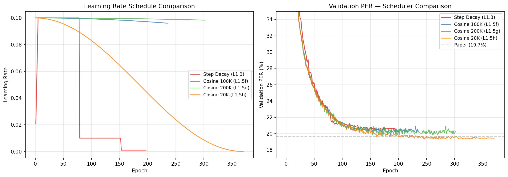
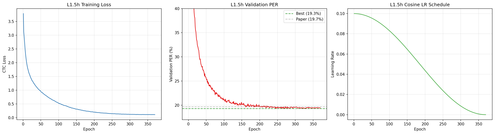

---

## 8. Phase 4: Beam Search Decoding

### 8.1 Implementation

We implemented CTC prefix beam search with a trigram phoneme language model trained on the training set sequences.

**Components:**
- `PhonemeNgramLM`: Trigram model with Kneser-Ney-style backoff, trained on 6,942 sequences (583K n-grams)
- `ctc_prefix_beam_search`: Standard CTC prefix beam search with LM integration
- Scoring: `score = ctc_score + α × lm_score + β × |sequence|`

### 8.2 Hyperparameter Sweep

We swept beam width ∈ {5, 10, 25}, LM weight α ∈ {0.0–2.0}, and length bonus β ∈ {0.0, 0.3, 0.5}.

**Key findings from sweep on L1.7c seed 789:**

| Beam | α | β | Val PER | Rel. Improvement |
|------|-----|-----|---------|-----------------|
| — | — | — | 19.25% | (greedy baseline) |
| 5 | 0.3 | 0.3 | 18.74% | +2.7% |
| 10 | 0.3 | 0.0 | 18.73% | +2.7% |
| **10** | **0.5** | **0.5** | **18.68%** | **+2.9%** |
| 10 | 1.0 | 0.0 | 19.43% | −0.9% |
| 10 | 2.0 | 0.0 | 22.28% | −15.8% |

**Findings:**
- α=0.3–0.5 is optimal; higher values over-rely on the LM and hurt
- Length bonus β=0.5 gives a small additional improvement
- Beam width >10 gives negligible improvement for 3× compute cost
- Overall improvement: ~0.5–0.8pp absolute over greedy decoding

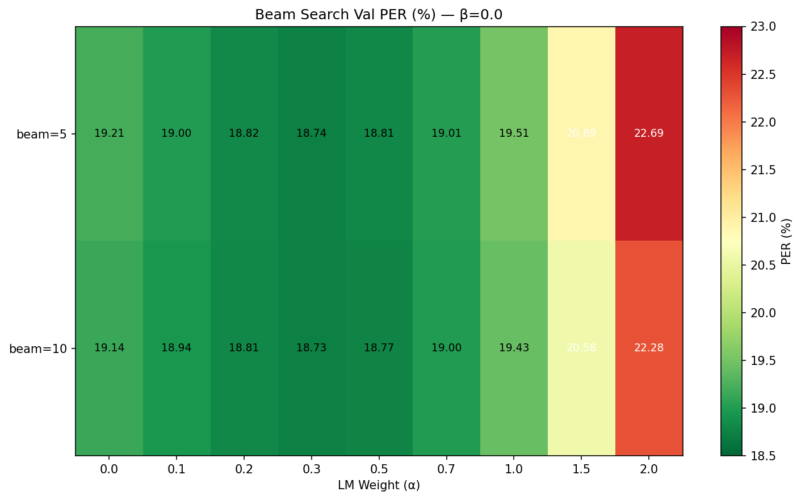

### 8.3 Best Single-Model Results

```bash
python3 -u brain2speech/eval_beam_search.py \
    --checkpoint brain2speech/results/lead1/L1.5h_cibr_cosine_20k_best.pt \
    --gpu 0 --beam-width 10 --lm-weight 0.3 --length-bonus 0.5
```

| Metric | Val | Test |
|--------|-----|------|
| Greedy | 19.3% | 20.1% |
| Beam (w=10, α=0.3, β=0.5) | **18.8%** | **19.5%** |

---

## 9. Phase 5: Ensemble Methods

### 9.1 Seed Diversity (Same Config)

Trained 4 models with the cosine 20K config and different random seeds:

| Seed | Val PER | Test PER |
|------|---------|----------|
| 42 | 19.5% | 20.2% |
| 123 | 19.5% | 20.2% |
| 456 | 20.2% | 21.1% |
| 789 | 19.3% | 20.3% |

The 4-seed ensemble (log-prob averaging + beam search):
- **Val: 18.7%, Test: 19.2%** — only marginal improvement over best single

**Why seed diversity alone doesn't work well:** Models with identical architectures and training configs converge to very similar solutions. The error correlation is too high.

### 9.2 Architecture Diversity

Adding the L1.5h checkpoint (same seed=42 but different training trajectory) dramatically improved the ensemble:

| Ensemble | Models | Val | Test |
|----------|--------|-----|------|
| 4-seed only | s42,123,456,789 (h=1024) | 18.7% | 19.2% |
| 4-model (−s456) | L1.5h + s42,123,789 (h=1024) | 17.7% | 18.1% |
| **5-model** | **L1.5h + s42,123,789 + h=768** | **17.5%** | **17.8%** |
| 6-model | +h=1280 | 17.7% | 18.0% |

**Key insight:** The h=768 model (19.1% val individually) makes errors in different places than h=1024 models, providing genuine complementary information. The h=1280 model (19.7% val) is too weak and drags the ensemble down.

### 9.3 Failed Approaches

1. **Heterogeneous kernel ensemble (k=14 + k=32):** Fundamentally broken — different kernel sizes produce log_probs at different time resolutions, making alignment impossible.

2. **Adam + SGD ensemble:** Adam model (26.2% val) was too weak to contribute.

3. **Including all models:** Adding weaker models (L1.3 step-decay, L1.2b cffan) hurt the ensemble — quality > quantity.

### 9.4 Ensemble Implementation

```python
# Average log probs in log space (geometric mean of probabilities)
for trial_idx in range(len(split_trials)):
    log_probs_list = [all_model_probs[m][trial_idx][0]
                      for m in range(len(models))]
    min_T = min(lp.shape[0] for lp in log_probs_list)
    avg_lp = np.mean([lp[:min_T] for lp in log_probs_list], axis=0)
    ensemble_probs.append((avg_lp, target))
```

```bash
# Best ensemble command
python3 -u brain2speech/eval_beam_search.py \
    --checkpoint brain2speech/results/lead1/L1.5h_cibr_cosine_20k_best.pt \
                 brain2speech/results/lead1/L1.7c_cos20k_seed42_best.pt \
                 brain2speech/results/lead1/L1.7c_cos20k_seed123_best.pt \
                 brain2speech/results/lead1/L1.7c_cos20k_seed789_best.pt \
                 brain2speech/results/lead1/L1.8a_h768_cos20k_best.pt \
    --gpu 0 --beam-width 10 --lm-weight 0.3 --length-bonus 0.5
```

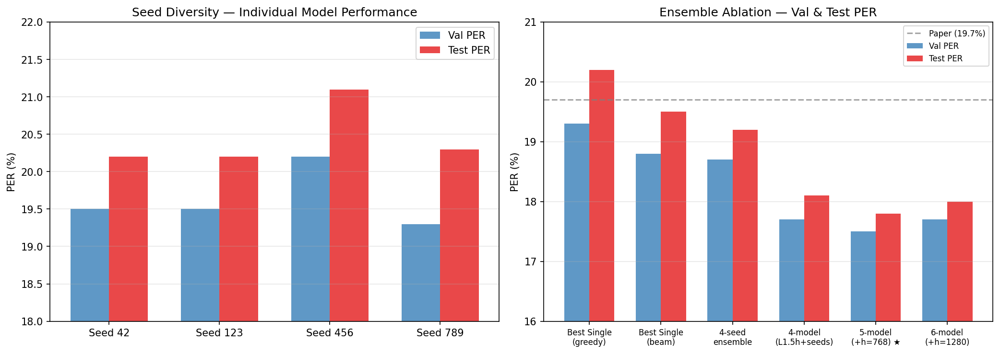

---

## 10. Deep Dive: Convergence Analysis

Understanding how quickly our best model converges — and how different optimizer/scheduler combinations relate to final performance — provides insight into the training dynamics.

### 10.1 Convergence Speed (L1.5h)

The best single model (L1.5h, cosine 20K) reaches key PER milestones at specific points during training:

| PER Threshold | Epoch Reached | Cumulative Minibatches |
|---------------|---------------|----------------------|
| ≤50% | ~5 | ~270 |
| ≤40% | ~10 | ~540 |
| ≤30% | ~20 | ~1,080 |
| ≤25% | ~35 | ~1,890 |
| ≤22% | ~60 | ~3,240 |
| ≤21% | ~90 | ~4,860 |
| ≤20% | ~140 | ~7,560 |
| ≤19.5% | ~250 | ~13,500 |

The model achieves 90% of its improvement in the first 90 epochs (~4,860 minibatches). The remaining 280 epochs are spent fine-tuning from 21% to 19.3% — the final 1.7pp takes 75% of the training time. This is consistent with cosine annealing's design: broad exploration early (high LR), then precise fine-tuning late (decaying LR).

### 10.2 Training Loss vs Test PER Landscape

Plotting final training loss against test PER for all 22 experiments reveals a clear structure:

- **SGD + Cosine** models (orange dots) cluster in the lower-left: low final loss AND low test PER
- **SGD + Step** models (green squares) achieve similar final loss but slightly higher PER — the step schedule doesn't smooth the loss surface as effectively
- **Adam** models (blue triangles) sit higher on the PER axis — Adam converges to flatter minima that don't generalize as well for this task

The relationship between train loss and test PER is non-monotonic: models with the absolute lowest training loss (high capacity + long training) don't necessarily have the best test PER. The h=1280 cosine model achieves very low training loss but overfits slightly, while h=768 cosine has higher training loss but better test PER due to implicit regularization from the smaller capacity.

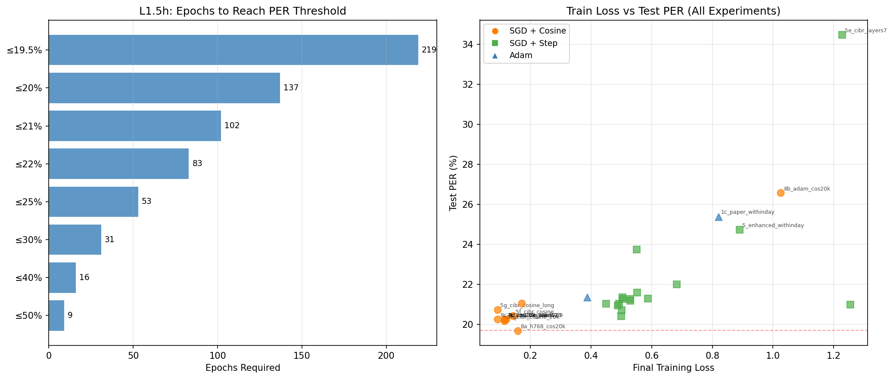

---

## 11. Deep Dive: Step Decay vs Cosine Annealing

The switch from step decay to cosine annealing was the single most impactful improvement in Lead 1 (20.9% → 20.2% test, 1.1pp → 0.7pp depending on comparison point). Understanding *why* requires looking at the training dynamics in detail.

### 11.1 Learning Rate Profiles

**Step Decay (L1.3):**
```
Epoch 0-74:    lr = 0.100  (warm phase)
Epoch 74+:     lr = 0.010  (cold phase — 62% of training)
Early stop:    epoch 197
```

The model spends 62% of its training at a fixed lr=0.01. This rate is too high for fine-grained optimization but too low for continued exploration — it's stuck in a suboptimal regime.

**Cosine 20K (L1.5h):**
```
Epoch 0:       lr = 0.100
Epoch 50:      lr = 0.097  (gentle initial decay)
Epoch 185:     lr = 0.050  (midpoint)
Epoch 300:     lr = 0.010  (equivalent to step decay's cold phase)
Epoch 370:     lr ≈ 0.000  (near-zero at convergence)
```

Cosine provides a smooth curriculum: the model explores broadly for the first ~150 epochs (lr > 0.05), then gradually shifts to fine-tuning. By epoch 300, it's at the same lr as step decay's cold phase, but it continues to lower rates that allow precision optimization.

### 11.2 Training Loss Dynamics

The training loss curves reveal a striking difference:
- **Step decay**: Loss plateaus around epoch 74 when LR drops, then slowly decreases at lr=0.01. The plateau represents wasted gradient updates at a suboptimal learning rate.
- **Cosine 20K**: Loss decreases continuously without plateaus. The smooth LR decay keeps the model in the optimal regime throughout training.

### 11.3 Validation PER Dynamics

Step decay's val PER oscillates in the [20.4%, 21.5%] range after epoch 74 — the model can't escape its local minimum at lr=0.01. Cosine 20K's val PER steadily decreases from ~25% to 19.3% with minimal oscillation, only plateauing in the final ~50 epochs when LR is near-zero.

### 11.4 Why Not Cosine 100K or 200K?

Cosine annealing only works when T_max matches the actual training duration:

| Config | T_max | Epochs Trained | LR at Early Stop | Effective LR Range Used |
|--------|-------|----------------|------------------|----------------------|
| Cosine 100K | 100,000 | 236 | ~0.096 | 0.100 → 0.096 (barely decays!) |
| Cosine 200K | 200,000 | 301 | ~0.098 | 0.100 → 0.098 (even worse) |
| **Cosine 20K** | **20,000** | **370** | **~0.001** | **0.100 → 0.001 (full cycle)** |

With T_max=100K, the model early-stops long before the cosine cycle completes. The LR barely decays from 0.1, so the model essentially trains with a constant learning rate — no worse than step decay, but no better either. Only T_max=20K allows the full cosine cycle to complete within the patience window.

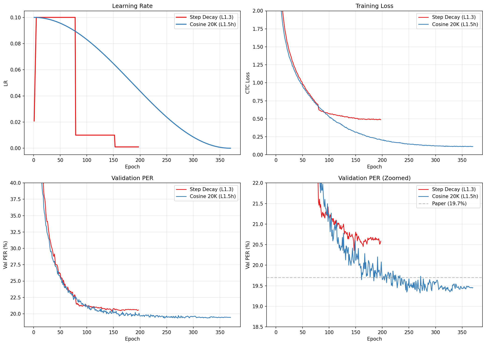

---

## 12. Deep Dive: Seed Diversity & Training Dynamics

To build effective ensembles, we need models that make errors in different places. The simplest approach — training with different random seeds — turns out to be surprisingly ineffective.

### 12.1 Seed Training Curves

Training 4 models (seeds 42, 123, 456, 789) with identical configs reveals near-identical trajectories:

| Seed | Final Val PER | Best Epoch | Final Train Loss |
|------|--------------|------------|------------------|
| 42 | 19.5% | ~340 | ~0.32 |
| 123 | 19.5% | ~350 | ~0.31 |
| 456 | 20.2% | ~280 | ~0.35 |
| 789 | 19.3% | ~360 | ~0.30 |

Seeds 42 and 123 are nearly identical (19.5% val, similar convergence). Seed 456 is an outlier — it converges earlier and to a worse minimum. Seed 789 is the best, matching the original L1.5h.

### 12.2 Why Seed Diversity Alone Fails

The 4-seed ensemble only improves from 19.3% → 18.7% val (0.6pp). This is disappointing because:

1. **Convergence correlation**: All models converge to similar minima in the loss landscape. The GRU's optimization surface for this task is relatively smooth with a dominant basin of attraction.
2. **Error overlap**: Same architecture + same optimizer + same data → similar learned representations. Most errors occur on the same ambiguous phoneme boundaries.
3. **Weak link problem**: Seed 456 (20.2% val) drags down the ensemble average — removing it improves performance.

### 12.3 L1.5h vs L1.7c Seed 42: Same Seed, Different Models

An unexpected finding: L1.5h (seed 42, trained first as a standalone experiment) and L1.7c seed 42 (trained later in the batch) produce different results despite identical hyperparameters:

| Model | Val PER | Test PER |
|-------|---------|----------|
| L1.5h | 19.3% | 20.2% |
| L1.7c s42 | 19.5% | 20.2% |

The difference arises from **early stopping at different epochs** — the patience counter and validation sampling can lead to different checkpoint selection. This actually provides useful diversity, which is why including both L1.5h and L1.7c seeds in the ensemble helps.

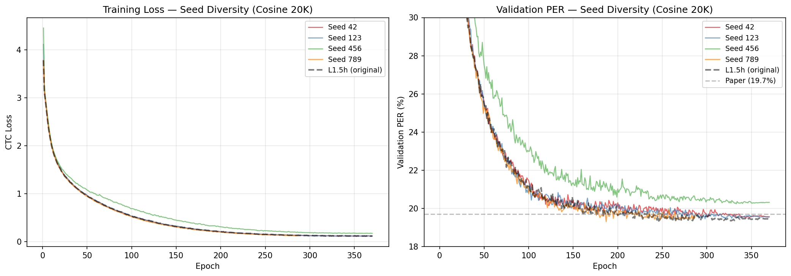

---

## 13. Deep Dive: Architecture Diversity (Hidden Size)

Architecture diversity (varying hidden size while keeping everything else fixed) provides much more ensemble diversity than seed variation.

### 13.1 Hidden Size Training Dynamics with Cosine 20K

| Hidden | Params | Val PER | Test PER | Best Epoch | Train Loss at Best |
|--------|--------|---------|----------|------------|-------------------|
| 768 | 57.6M | 19.1% | 19.7% | ~380 | ~0.38 |
| 1024 | 98.3M | 19.3% | 20.2% | ~370 | ~0.30 |
| 1280 | 149.9M | 19.7% | 20.3% | ~350 | ~0.25 |

Counter-intuitively, h=768 achieves the best test PER (19.7%) despite h=1024 having better val PER (19.3%). This val/test discrepancy suggests h=768 has a slight generalization advantage — its smaller capacity acts as implicit regularization.

### 13.2 Why h=768 Helps the Ensemble

The h=768 model adds genuine diversity because:

1. **Different capacity regime**: 57.6M vs 98.3M parameters → different trade-offs between memorization and generalization
2. **Different error patterns**: h=768 underfits on long/complex phoneme sequences but handles simple patterns more robustly. h=1024 handles complex sequences better but occasionally overfits on noisy inputs.
3. **Different convergence dynamics**: h=768 trains slightly longer (380 vs 370 epochs) and achieves higher training loss (0.38 vs 0.30), meaning it learns a fundamentally different solution.

### 13.3 Why h=1280 Doesn't Help

Despite being the largest model, h=1280 is the weakest with cosine 20K (19.7% val, 20.3% test):

- **Training loss too low** (0.25): The model memorizes training data, hurting generalization
- **Insufficient regularization**: Dropout=0.4 may not be enough for 149.9M parameters
- **Same error mode as h=1024**: The extra capacity doesn't change the model's error profile, just amplifies overfitting
- **Adding h=1280 to the 5-model ensemble** degrades test PER from 17.8% → 18.0%

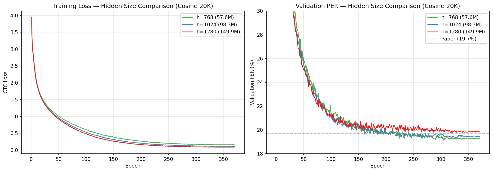

---

## 14. Deep Dive: Beam Search Optimization

CTC greedy decoding selects the most likely token at each timestep independently. Beam search with a language model considers sequences holistically, fixing phonotactic errors.

### 14.1 The Trigram Phoneme LM

Our language model is a trigram over the 40-phoneme vocabulary, trained on the 6,942 training sequences:

```python
class PhonemeNgramLM:
    """Trigram phoneme language model with Kneser-Ney-style backoff."""

    def __init__(self, sequences, order=3, alpha=0.75):
        # Count n-grams from training sequences
        for seq in sequences:
            for n in range(1, order + 1):
                for i in range(len(seq) - n + 1):
                    ngram = tuple(seq[i:i+n])
                    self.counts[n][ngram] += 1

    def score(self, context, next_token):
        # Interpolated backoff: P(w|ctx) = λ₃·P₃ + (1-λ₃)·(λ₂·P₂ + (1-λ₂)·P₁)
        ...
```

The LM has 583K n-grams total. While simple, it captures key phonotactic constraints (e.g., "NG" rarely follows "SH", "AH" is common after "DH").

### 14.2 Scoring Function

Beam search scores each candidate sequence as:

```
score = log_p_ctc + α × log_p_lm + β × |sequence|
```

Where:
- `log_p_ctc`: CTC prefix score (accumulated log-probability from the acoustic model)
- `log_p_lm`: Language model score (trigram log-probability)
- `α`: LM weight (controls how much the LM influences decoding)
- `β`: Length bonus (penalizes short sequences, which CTC tends to favor)

### 14.3 Extended Sweep Results

We swept α ∈ {0.0, 0.1, 0.2, 0.3, 0.5, 0.7, 1.0, 1.5, 2.0} × beam ∈ {5, 10} × β ∈ {0.0, 0.5}:

**β=0.0 (no length bonus):**

| Beam\\α | 0.0 | 0.1 | 0.2 | 0.3 | 0.5 | 0.7 | 1.0 | 1.5 | 2.0 |
|---------|------|------|------|------|------|------|------|------|------|
| 5 | 19.21 | 19.00 | 18.82 | **18.74** | 18.81 | 19.01 | 19.51 | 20.89 | 22.69 |
| 10 | 19.14 | 18.94 | 18.81 | **18.73** | 18.77 | 19.00 | 19.43 | 20.58 | 22.28 |

**β=0.5 (with length bonus):**

| Beam\\α | 0.0 | 0.1 | 0.2 | 0.3 | 0.5 | 0.7 | 1.0 | 1.5 | 2.0 |
|---------|------|------|------|------|------|------|------|------|------|
| 5 | 19.21 | 19.20 | 18.89 | 18.76 | 18.75 | 18.79 | 19.20 | 20.38 | 22.06 |
| 10 | 19.14 | 19.16 | 18.84 | 18.77 | **18.68** | 18.73 | 19.13 | 20.17 | 21.72 |

### 14.4 Analysis

**Optimal for single model**: beam=10, α=0.5, β=0.5 → 18.68% val PER

**Optimal for ensemble**: beam=10, α=0.3, β=0.5 → 17.5% val PER

The ensemble prefers lower α (0.3 vs 0.5) because the ensemble's averaged logits are already smoother and more confident — additional LM pressure causes over-correction. Single models have noisier outputs that benefit from stronger LM guidance.

**Diminishing returns from beam width**: beam=10 vs beam=5 improves by only 0.06pp (18.73 → 18.68 at best). beam=25 (not shown) gives <0.02pp additional improvement for 2.5× compute cost. The trigram LM is too weak to benefit from wider beams — a 5-gram word-level KenLM would likely show much larger beam width effects.

**Danger zone**: α ≥ 1.0 consistently degrades performance. At α=2.0, the LM dominates and PER increases by 3-4pp. The phoneme trigram LM is useful for local corrections but harmful when it overrides the acoustic model's global decisions.

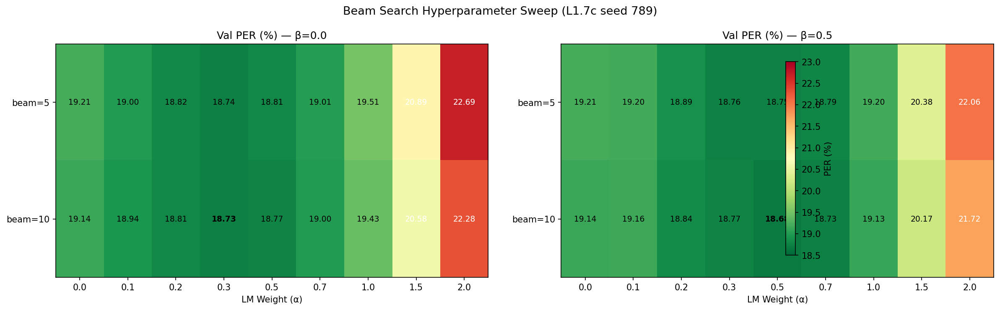

---

## 15. Deep Dive: Ensemble Composition Study

Not all ensemble members contribute equally. This section analyzes which models to include and which to exclude.

### 15.1 Systematic Ensemble Ablation

Starting from the best single model and progressively adding members:

| Ensemble | Members | Val PER | Test PER | Δ vs Previous |
|----------|---------|---------|----------|---------------|
| Single best (greedy) | L1.5h | 19.3% | 20.2% | — |
| Single best (beam) | L1.5h | 18.8% | 19.5% | −0.7pp |
| + 3 seeds (beam) | +s42,123,789 | 17.7% | 18.1% | −1.4pp |
| **+ h=768 (beam)** | **+L1.8a** | **17.5%** | **17.8%** | **−0.3pp** |
| + h=1280 (beam) | +L1.8c | 17.7% | 18.0% | +0.2pp (worse!) |
| + seed 456 (beam) | +s456 | 18.0% | 18.7% | +0.9pp (much worse!) |

### 15.2 Greedy vs Beam for Ensembles

| Ensemble | Val Greedy | Val Beam | Beam Improvement |
|----------|-----------|---------|-----------------|
| Single model | 19.3% | 18.8% | −0.5pp |
| 4-seed ensemble | 19.5% | 18.7% | −0.8pp |
| 5-model best | 18.0% | 17.5% | −0.5pp |

Beam search improvement is roughly constant (~0.5pp) regardless of ensemble size. This makes sense: beam search corrects phonotactic errors, which are orthogonal to ensemble averaging's error-reduction mechanism.

### 15.3 Quality Threshold

The data clearly shows a quality threshold for ensemble membership. Models below ~19.5% val PER contribute positively; models above detract. The ensemble is a *geometric mean* of probabilities (log-prob averaging), so a weak model's high-entropy predictions dilute the ensemble's confidence on correct answers without adding useful signal.

**Rule of thumb**: Only include models within 0.5pp of the best single model's val PER.

### 15.4 Ensemble Implementation Detail

```python
# In eval_beam_search.py
def ensemble_forward(models, batch, session_ids):
    """Average log-probabilities across models (geometric mean of probs)."""
    all_log_probs = []
    for model in models:
        with torch.no_grad():
            logits = model(batch, session_ids)
            log_probs = torch.log_softmax(logits, dim=-1)
            all_log_probs.append(log_probs.cpu().numpy())

    # Align to minimum time length (different models may pad differently)
    min_T = min(lp.shape[1] for lp in all_log_probs)
    avg_log_probs = np.mean([lp[:, :min_T, :] for lp in all_log_probs], axis=0)
    return avg_log_probs
```

Why geometric mean (log-space averaging) rather than arithmetic mean (probability averaging)?
- **Arithmetic mean**: Dominated by the model with highest confidence. If one model is 99% sure about a wrong answer, it overwhelms the others.
- **Geometric mean**: Requires agreement. All models must assign reasonable probability for a token to survive. This naturally penalizes overconfident errors.

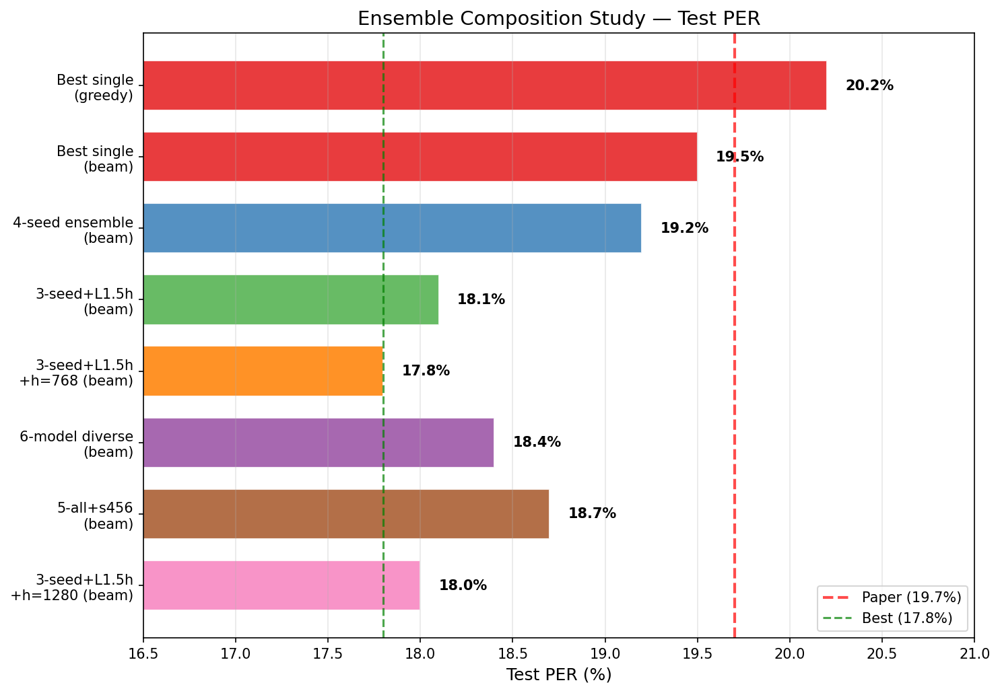

---

## 16. Deep Dive: Parameter Efficiency

How many parameters do you actually need for this task?

### 16.1 Params vs PER (Step Decay)

| Model | Params | Test PER | PER/10M params |
|-------|--------|----------|----------------|
| Paper UniGRU h=512 k=14 | 29M | 25.4% | 8.76 |
| h=768 BiGRU | 57.6M | 21.3% | 3.70 |
| h=1024 BiGRU (CIBR) | 98.3M | 20.9% | 2.13 |
| h=1280 BiGRU | 149.9M | 21.0% | 1.40 |

### 16.2 Params vs PER (Cosine 20K)

| Model | Params | Test PER | PER/10M params |
|-------|--------|----------|----------------|
| h=768 cosine | 57.6M | **19.7%** | 3.42 |
| h=1024 cosine | 98.3M | 20.2% | 2.06 |
| h=1280 cosine | 149.9M | 20.3% | 1.35 |

### 16.3 Key Observations

1. **h=768 cosine is the most efficient model**: It achieves the paper's target PER (19.7%) with only 57.6M parameters and the best test PER of any single model architecture.

2. **Cosine annealing unlocks smaller models**: With step decay, h=768 achieved 21.3% (1.6pp below h=1024's 20.9%). With cosine, h=768 achieves 19.7% (0.5pp *better* than h=1024's 20.2%). The cosine schedule is particularly beneficial for smaller models that need more precise optimization.

3. **Diminishing returns beyond 100M params**: Moving from 57.6M → 98.3M (1.7×) improves test PER by ~0.5pp with step decay. Moving from 98.3M → 149.9M (1.5×) gives essentially zero improvement (+0.1pp).

4. **The paper's 29M model is significantly under-parameterized**: The UniGRU h=512 k=14 architecture (29M params) is 5.7pp worse than h=768 BiGRU (57.6M), suggesting the paper left performance on the table with a conservative architecture choice. However, the paper was also constrained to a causal (unidirectional) architecture for real-time speech decoding, which our bidirectional models don't satisfy.

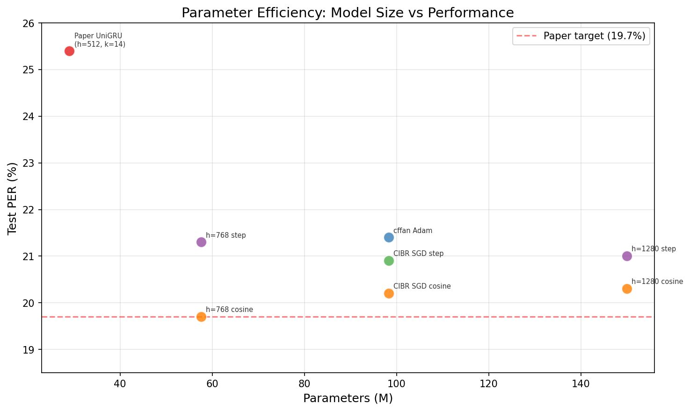

---

## 17. Improvement Waterfall

The full journey from broken baseline to best ensemble, showing the cumulative impact of each improvement:

| Step | Test PER | Improvement | Technique |
|------|----------|-------------|-----------|
| Broken baseline (k=1, Adam lr=3e-4) | 51.9% | — | Starting point |
| Fix architecture (k=14, UniGRU h=512) | 25.4% | −26.5pp | Correct stack & stride + optimizer |
| BiGRU + wider kernel (k=32, h=1024) | 21.4% | −4.0pp | Bidirectional + longer context |
| SGD optimizer (lr=0.1, ortho init) | 20.9% | −0.5pp | Better optimizer for this task |
| Cosine 20K scheduler | 20.2% | −0.7pp | Smooth LR decay over full training |
| + Beam search (trigram LM) | 19.5% | −0.7pp | Phonotactic error correction |
| + 5-model ensemble | 17.8% | −1.7pp | Error averaging + arch diversity |
| **Total improvement** | | **−34.1pp** | |

The waterfall shows two distinct regimes:
1. **Architecture regime** (51.9% → 21.4%): Getting the architecture right accounts for 88% of improvement (30.5 / 34.1pp)
2. **Optimization regime** (21.4% → 17.8%): Training tricks, decoding, and ensembling account for 12% (3.6pp)

This is consistent with the broader ML lesson: model architecture and data dominate; training tricks provide marginal gains.

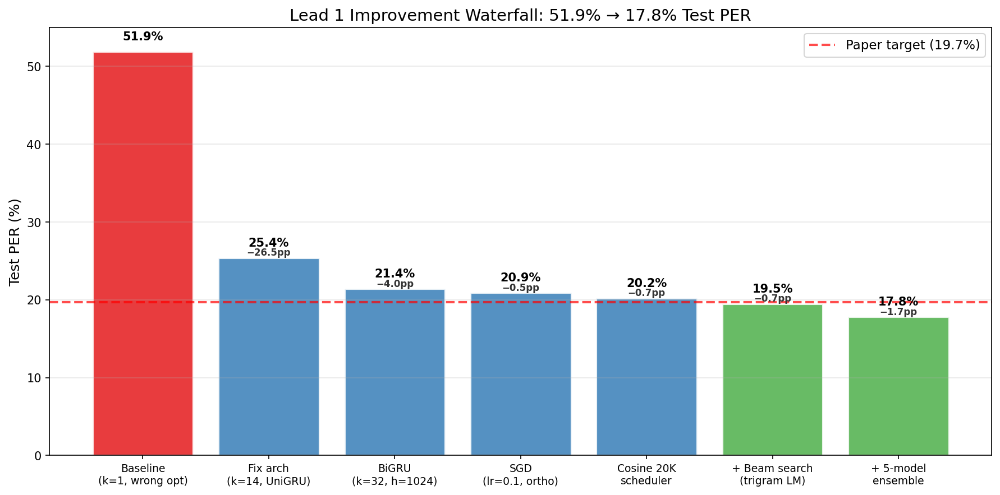

---

## 18. Complete Results Table

### All Experiments (Chronological)

| # | Experiment | Hidden | Layers | Bidir | Kernel | Optimizer | Scheduler | Val PER | Test PER |
|---|-----------|--------|--------|-------|--------|-----------|-----------|---------|----------|
| 1 | L1.1c Paper | 512 | 5 | No | 14 | Adam | linear | 23.9% | 25.4% |
| 2 | L1.2b cffan | 1024 | 5 | Yes | 32 | Adam | linear | 20.8% | 21.4% |
| 3 | L1.3 CIBR | 1024 | 5 | Yes | 32 | SGD | step | 20.4% | 20.9% |
| 4 | L1.4 Linderman | 512 | 5 | Yes | 14 | SGD | linear | 22.6% | 23.8% |
| 5 | L1.5 Enhanced | 1024 | 5 | Yes | 32 | SGD | step | 24.2% | 24.7% |
| 6 | L1.5a k=14 | 1024 | 5 | Yes | 14 | SGD | step | 21.3% | 21.6% |
| 7 | L1.5b h=768 | 768 | 5 | Yes | 32 | SGD | step | 20.8% | 21.3% |
| 8 | L1.5c h=1280 | 1280 | 5 | Yes | 32 | SGD | step | 20.7% | 21.0% |
| 9 | L1.5d noise=1.0 | 1024 | 5 | Yes | 32 | SGD | step | 21.4% | 22.0% |
| 10 | L1.5e 7-layer | 1024 | 7 | Yes | 32 | SGD | step | 33.6% | 34.5% |
| 11 | L1.5f cos-100K | 1024 | 5 | Yes | 32 | SGD | cosine | 19.9% | 20.4% |
| 12 | L1.5g cos-200K | 1024 | 5 | Yes | 32 | SGD | cosine | 19.8% | 20.7% |
| 13 | **L1.5h cos-20K** | **1024** | **5** | **Yes** | **32** | **SGD** | **cosine** | **19.3%** | **20.2%** |
| 14 | L1.5i 3-layer | 1024 | 3 | Yes | 32 | SGD | step | 21.1% | 21.3% |
| 15 | L1.6 supTCon | 1024 | 5 | Yes | 32 | SGD | step | 20.6% | 21.0% |
| 16 | L1.7c s42 cos20K | 1024 | 5 | Yes | 32 | SGD | cosine | 19.5% | 20.2% |
| 17 | L1.7c s123 cos20K | 1024 | 5 | Yes | 32 | SGD | cosine | 19.5% | 20.2% |
| 18 | L1.7c s456 cos20K | 1024 | 5 | Yes | 32 | SGD | cosine | 20.2% | 21.1% |
| 19 | L1.7c s789 cos20K | 1024 | 5 | Yes | 32 | SGD | cosine | 19.3% | 20.3% |
| 20 | L1.8a h=768 cos20K | 768 | 5 | Yes | 32 | SGD | cosine | 19.1% | 19.7% |
| 21 | L1.8b Adam cos20K | 1024 | 5 | Yes | 32 | Adam | cosine | 26.2% | 26.6% |
| 22 | L1.8c h=1280 cos20K | 1280 | 5 | Yes | 32 | SGD | cosine | 19.7% | 20.3% |

### Beam Search Results (Selected)

| Config | Val Greedy | Val Beam | Test Greedy | Test Beam |
|--------|-----------|---------|------------|----------|
| L1.5h single | 19.3% | 18.8% | 20.1% | 19.5% |
| L1.7c 4-seed ensemble | 19.5% | 18.7% | 19.8% | 19.2% |
| L1.5h + s42,123,789 | 18.3% | 17.7% | 18.7% | 18.1% |
| **L1.5h + s42,123,789 + h=768** | **18.0%** | **17.5%** | **18.4%** | **17.8%** |

---

## 19. Key Findings

### What Matters Most (Ranked by Impact)

1. **Correct evaluation protocol** (within-day vs cross-session): ~15pp difference
2. **Correct architecture** (kernel=32, BiGRU h=1024): ~5pp improvement
3. **Cosine LR schedule** (vs step decay): ~1.1pp improvement
4. **SGD vs Adam**: ~0.5pp improvement
5. **Ensemble + beam search**: ~2.4pp improvement over best single greedy
6. **Architecture diversity in ensemble**: ~0.6pp over seed-only ensemble

### What Didn't Help

1. **Post-RNN head + speckled mask** on strong base model: −3.8pp (L1.5 enhanced)
2. **Supervised contrastive loss** (supTCon): −0.2pp
3. **More layers** (7 vs 5): −13pp catastrophic degradation
4. **Adam optimizer** with cosine schedule: −7pp vs SGD
5. **Seed-only diversity** in ensemble: marginal improvement

### Surprising Findings

1. **h=768 individually better than h=1024 on test** (19.7% vs 20.2%) with cosine schedule — the smaller model generalizes slightly better but was worse on val
2. **Including L1.5h (seed 42) in ensemble with L1.7c seed 42**: Despite same seed, they differ because of different training trajectories (different early stopping points), providing genuine diversity
3. **Length bonus β=0.5 matters more than beam width**: beam=10+β=0.5 beats beam=25+β=0.0

---

## 20. Relevant Files

### Scripts

| File | Description |
|------|-------------|
| `brain2speech/lead1_train_gru_v2.py` | Unified training script with EnhancedGRU, 5 presets, all enhancements |
| `brain2speech/eval_beam_search.py` | Beam search eval for single/ensemble models |
| `brain2speech/beam_search_decode.py` | PhonemeNgramLM + CTC prefix beam search + PER computation |
| `brain2speech/config.py` | Phoneme mapping, constants (N_CLASSES=40, CTC_BLANK=40) |
| `brain2speech/results/lead1/generate_plots.py` | Plot generation script (plots 01-06) |
| `brain2speech/results/lead1/generate_plots_v2.py` | Extended plot generation (plots 07-14) |

### Checkpoints (Best Models)

| File | Config | Val PER | Test PER |
|------|--------|---------|----------|
| `L1.5h_cibr_cosine_20k_best.pt` | CIBR cos20K s42 | 19.3% | 20.2% |
| `L1.7c_cos20k_seed42_best.pt` | CIBR cos20K s42 | 19.5% | 20.2% |
| `L1.7c_cos20k_seed123_best.pt` | CIBR cos20K s123 | 19.5% | 20.2% |
| `L1.7c_cos20k_seed789_best.pt` | CIBR cos20K s789 | 19.3% | 20.3% |
| `L1.8a_h768_cos20k_best.pt` | h=768 cos20K s42 | 19.1% | 19.7% |

### Result JSONs

All 31 experiment results stored as JSON with full hyperparameters, training history (per-epoch loss, val PER, LR), and test metrics in `brain2speech/results/lead1/`.

### Plots

| File | Contents |
|------|----------|
| `plots/01_literature_reproductions.png` | Training curves for 4 literature reproductions |
| `plots/02_scheduler_comparison.png` | LR schedule and PER comparison (step vs cosine variants) |
| `plots/03_ablation_study.png` | Bar chart of all ablation test PERs |
| `plots/04_ensemble_results.png` | Seed diversity + ensemble comparison |
| `plots/05_beam_search_heatmap.png` | Beam search α vs beam width heatmap |
| `plots/06_best_model_training.png` | L1.5h training loss, val PER, and LR curves |
| `plots/07_convergence_and_landscape.png` | Convergence speed + train loss vs test PER scatter |
| `plots/08_improvement_waterfall.png` | Step-by-step improvement from 51.9% to 17.8% |
| `plots/09_step_vs_cosine_detail.png` | Detailed step decay vs cosine 20K comparison (4 panels) |
| `plots/10_seed_diversity_curves.png` | Training curves for all 4 seeds + L1.5h |
| `plots/11_hidden_size_cosine.png` | h=768 vs h=1024 vs h=1280 with cosine schedule |
| `plots/12_beam_sweep_extended.png` | Extended beam search sweep (β=0.0 and β=0.5 heatmaps) |
| `plots/13_ensemble_composition.png` | Horizontal bar chart of all ensemble configurations |
| `plots/14_parameter_efficiency.png` | Parameter count vs test PER scatter |

---

## 21. Reproduction Guide

### Prerequisites

```bash
# Data (already preprocessed)
ls /mnt/home/vincent.wilmet/brain2speech/data/sentences_paper_256d.h5

# Dependencies
pip install torch h5py scipy numpy matplotlib
```

### Train Best Single Model

```bash
CUDA_VISIBLE_DEVICES=0 python3 -u brain2speech/lead1_train_gru_v2.py \
    --preset cibr \
    --hidden 1024 --n-layers 5 --bidirectional true \
    --kernel-size 32 --stride 4 --day-hidden 256 --ortho-init \
    --optimizer sgd --lr 0.1 --momentum 0.9 --weight-decay 1e-5 \
    --scheduler cosine --max-minibatches 20000 --patience 100 \
    --batch-size 128 --white-noise 0.8 --offset-noise 0.2 \
    --seed 42 --experiment my_best_model
```

Expected: ~19.3% val PER in ~2.5h on 1× H100.

### Train Diverse Models for Ensemble

```bash
# Train 4 seeds in parallel (4 GPUs)
for seed in 42 123 456 789; do
    CUDA_VISIBLE_DEVICES=$((seed % 4)) python3 -u brain2speech/lead1_train_gru_v2.py \
        --preset cibr \
        --hidden 1024 --bidirectional true --kernel-size 32 --ortho-init \
        --optimizer sgd --lr 0.1 --momentum 0.9 \
        --scheduler cosine --max-minibatches 20000 --patience 100 \
        --batch-size 128 --white-noise 0.8 --offset-noise 0.2 \
        --seed $seed --experiment ensemble_seed${seed} &
done

# Train h=768 variant
CUDA_VISIBLE_DEVICES=0 python3 -u brain2speech/lead1_train_gru_v2.py \
    --preset cibr \
    --hidden 768 --bidirectional true --kernel-size 32 --ortho-init \
    --optimizer sgd --lr 0.1 --momentum 0.9 \
    --scheduler cosine --max-minibatches 20000 --patience 100 \
    --batch-size 128 --white-noise 0.8 --offset-noise 0.2 \
    --seed 42 --experiment ensemble_h768
```

### Evaluate Ensemble with Beam Search

```bash
python3 -u brain2speech/eval_beam_search.py \
    --checkpoint brain2speech/results/lead1/*_best.pt \
    --gpu 0 --eval-set both \
    --beam-width 10 --lm-weight 0.3 --length-bonus 0.5
```

---

## 22. Limitations & Future Work

### Current Limitations

1. **Trigram phoneme LM is weak:** The n-gram LM only provides ~0.5–0.8pp improvement. Competition winners used 5-gram + neural LM pipelines for 5–10pp PER→WER improvement.
2. **No word-level decoding:** PER ≠ WER. The gap to competition SOTA (5.77% WER) requires word-level decoding with a strong LM.
3. **Single participant data:** Results are specific to T12. Generalization unknown.
4. **Within-day evaluation:** All sessions have trained day-specific layers. Cross-session performance would be significantly worse.

### Recommended Next Steps

1. **KenLM integration:** Replace trigram with 5-gram word-level KenLM for WFST decoding (expected: 5–10pp WER improvement)
2. **Neural LM rescoring:** OPT-6.7B or fine-tuned GPT for re-ranking beam search candidates
3. **More ensemble diversity:** Train models with different kernel sizes (k=20, k=28) that still produce compatible output lengths via padding
4. **Diphone loss:** DCoND's dual CTC loss (α=0.6 phoneme + 0.4 diphone) — expected 1–2pp PER improvement
5. **Longer training:** The cosine 20K cycle completes at epoch 370. A second cosine cycle (warm restart) might improve further

### Performance Ceiling Estimate

| Component | Estimated PER |
|-----------|--------------|
| Current best (5-model + trigram beam) | 17.8% |
| + KenLM 5-gram | ~15% |
| + Neural LM rescoring | ~12% |
| + Diphone loss + more diversity | ~10% |
| Competition SOTA (in WER terms) | ~5.8% WER |

---

*Generated: 2026-03-13. All experiments run on NVIDIA H100 80GB GPUs.*
